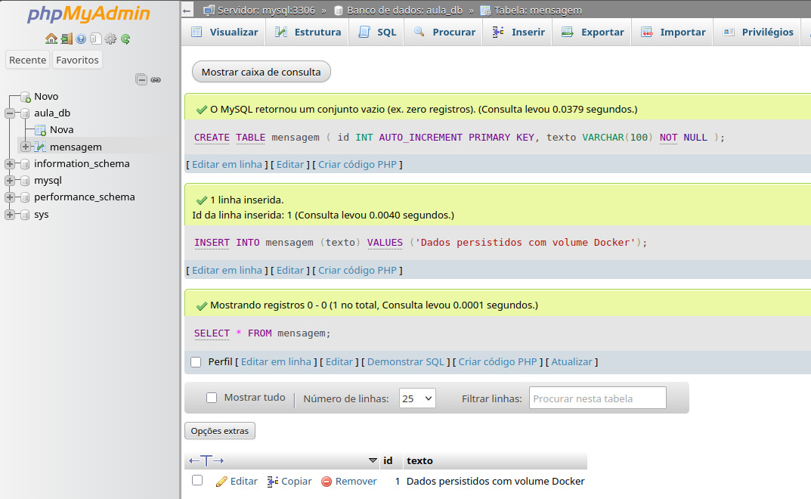

# GIT-PRATICA-DOCKER-24-08-2026
## 1. Identificação

Atividade prática referente ao dia **24/08/2026**, do componente curricular **Integração e Entrega Contínua**, do curso de **Desenvolvimento de Software Multiplataforma – 4º semestre**, da **FATEC Mauá**, ministrada pelo professor **Carlos Ronny**.

**Aluno(a):** Thaisa Vitória

---

## 2. Docker no Codespaces

A atividade foi realizada em um ambiente GitHub Codespaces.

Versão do Docker utilizada:

```text
Docker version 29.3.0-1
```

O comando `docker info` foi executado com sucesso, confirmando que o Docker estava disponível e funcionando corretamente no ambiente.

O Docker Compose também estava disponível na versão:

```text
Docker Compose v2.40.3
```

---

## 3. Contêiner Nginx

Foi utilizada a imagem oficial `nginx:latest` para criar um contêiner chamado `meu_nginx`.

O contêiner foi iniciado em segundo plano com o mapeamento da porta `8080` do Codespace para a porta `80` do Nginx:

```bash
docker run -d --name meu_nginx -p 8080:80 nginx:latest
```

O serviço foi acessado com sucesso através da porta 8080 disponibilizada pelo GitHub Codespaces, exibindo a página padrão do Nginx.

Também foi realizado o acesso ao interior do contêiner com:

```bash
docker exec -it meu_nginx sh
```

Ao verificar o diretório padrão do Nginx:

```bash
ls /usr/share/nginx/html
```

foram encontrados os arquivos:

```text
50x.html
index.html
```

Após os testes, o contêiner foi parado e removido utilizando:

```bash
docker stop meu_nginx
docker rm meu_nginx
```

---

## 4. Imagem personalizada

Foi criado um arquivo `Dockerfile` utilizando a imagem base `ubuntu:24.04`.

A imagem personalizada foi construída com o comando:

```bash
docker build -t aula-docker:1.0 .
```

**Nome da imagem:** `aula-docker`

**Tag:** `1.0`

Após a construção, a imagem foi executada com:

```bash
docker run --rm aula-docker:1.0
```

Resultado obtido:

```text
Olá! Esta imagem Docker foi criada na aula de Integração e Entrega Contínua.
```

Isso confirmou que o arquivo `hello.txt` foi corretamente copiado para a imagem e executado conforme definido no `Dockerfile`.

---

## 5. Docker Compose

Foi criado o arquivo `compose.yaml` contendo dois serviços:

* MySQL 8.4
* phpMyAdmin

O ambiente foi iniciado com:

```bash
docker compose up -d
```

O comando:

```bash
docker compose ps
```

confirmou que os dois serviços estavam em execução:

```text
NAME              IMAGE               SERVICE
aula-mysql        mysql:8.4           mysql
aula-phpmyadmin   phpmyadmin:latest   phpmyadmin
```

O MySQL foi disponibilizado pela porta `3306` e o phpMyAdmin pela porta `8080`.

O phpMyAdmin foi acessado com sucesso através da porta encaminhada pelo GitHub Codespaces.

Foi utilizado:

```text
Usuário: root
Senha: root_password
```

Também foi confirmada a existência do banco:

```text
aula_db
```

---

## 6. Persistência

Para testar a persistência de dados foi utilizado o volume Docker:

```text
mysql-data
```

No banco `aula_db`, foi criada a tabela `mensagem` e inserido o registro:

```text
Dados persistidos com volume Docker
```

Em seguida, os contêineres foram removidos com:

```bash
docker compose down
```

e recriados com:

```bash
docker compose up -d
```

O volume não foi removido durante esse processo.

**Resultado da verificação:** 

Isso ocorre porque os dados do MySQL são armazenados no volume `mysql-data`, fora do ciclo de vida dos contêineres. Portanto, remover e recriar os contêineres não remove automaticamente as informações armazenadas no volume.

---

## 7. Evidências

### Evidência 1 - Docker disponível no Codespaces

```text
Docker version 29.3.0-1
```

O comando `docker info` também foi executado com sucesso.

### Evidência 2 - Imagem Nginx

```text
IMAGE
nginx:latest
```

O contêiner `meu_nginx` foi executado e a página padrão do Nginx foi acessada através da porta 8080.

### Evidência 3 - Conteúdo do contêiner Nginx

```text
50x.html
index.html
```

### Evidência 4 - Imagem personalizada

```text
IMAGE
aula-docker:1.0
nginx:latest
```

Resultado da execução:

```text
Olá! Esta imagem Docker foi criada na aula de Integração e Entrega Contínua.
```

### Evidência 5 - Docker Compose

Após a execução de `docker compose up -d`, os serviços foram iniciados:

```text
aula-mysql
aula-phpmyadmin
```

### Evidência 6 - Persistência

O ambiente foi encerrado e recriado utilizando:

```bash
docker compose down
docker compose up -d
docker compose ps
```

O volume `mysql-data` foi preservado durante o processo.

---

## 8. Perguntas da atividade

### 1. Qual é a diferença entre uma imagem Docker e um contêiner?

Uma **imagem Docker** é um modelo imutável que contém os arquivos, dependências e instruções necessárias para executar uma aplicação.

Um **contêiner** é uma instância criada a partir dessa imagem e que pode ser executada pelo Docker.

Assim, uma mesma imagem pode ser utilizada para criar vários contêineres.

### 2. O que significa o mapeamento de portas `8080:80`?

O mapeamento `8080:80` associa a porta `8080` do ambiente onde o Docker está sendo executado à porta `80` do contêiner.

Neste exercício, o Nginx e o phpMyAdmin utilizam internamente a porta `80`, enquanto o acesso externo é realizado através da porta `8080` do Codespace.

### 3. Qual é a função do Dockerfile neste exercício?

O `Dockerfile` descreve as instruções necessárias para construir a imagem personalizada.

Neste exercício, ele:

* utiliza o Ubuntu 24.04 como imagem base;
* define `/app` como diretório de trabalho;
* copia o arquivo `hello.txt`;
* determina que o conteúdo do arquivo seja exibido quando o contêiner for iniciado.

### 4. Por que o serviço phpMyAdmin consegue acessar o MySQL usando `PMA_HOST: mysql`?

O Docker Compose cria uma rede para os serviços definidos no arquivo `compose.yaml`.

Dentro dessa rede, os serviços podem se comunicar utilizando seus próprios nomes.

Como o serviço do banco foi definido com o nome `mysql`, o phpMyAdmin consegue encontrá-lo utilizando:

```yaml
PMA_HOST: mysql
```

Não é necessário informar manualmente o endereço IP do contêiner.

### 5. Qual é a função do volume `mysql-data`?

O volume `mysql-data` armazena os dados do MySQL fora do ciclo de vida do contêiner.

Isso permite que os dados continuem disponíveis mesmo quando o contêiner do MySQL é removido e posteriormente recriado.

Neste exercício, ele é associado ao diretório:

```text
/var/lib/mysql
```

que é onde o MySQL mantém seus dados.

### 6. O que aconteceria com os dados se o ambiente fosse encerrado com `docker compose down -v`?

A opção `-v` também remove os volumes associados ao ambiente Docker Compose.

Portanto, ao executar:

```bash
docker compose down -v
```

o volume `mysql-data` seria removido e os dados armazenados nele seriam apagados.

Diferentemente do comando `docker compose down` utilizado no teste de persistência, os dados não permaneceriam disponíveis após a recriação do ambiente.

---

## 9. Arquivos da atividade

O repositório contém os seguintes arquivos principais:

```text
Dockerfile
hello.txt
compose.yaml
README.md
```

Esses arquivos permitem compreender a atividade e reconstruir o ambiente Docker utilizado durante a prática.


