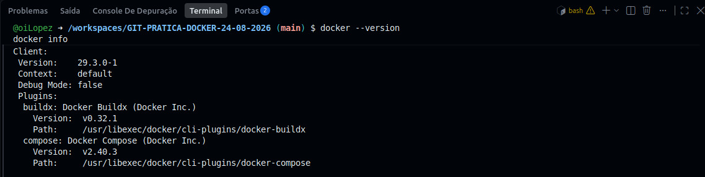
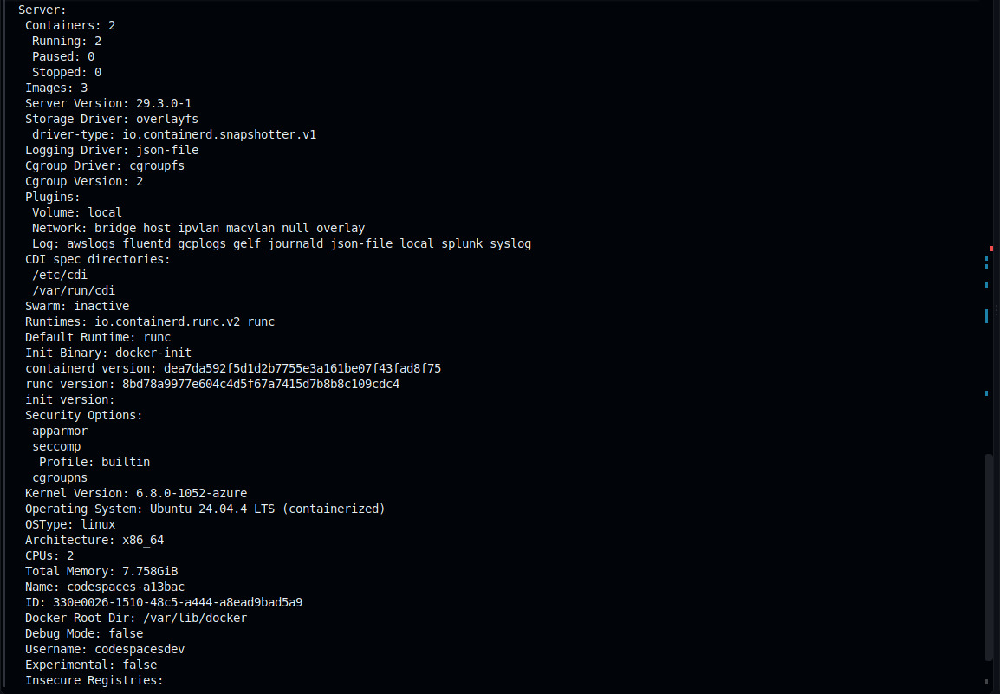
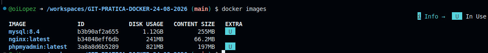
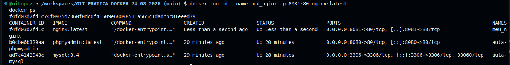
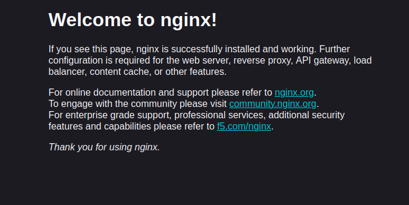
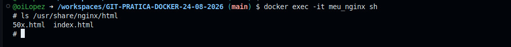
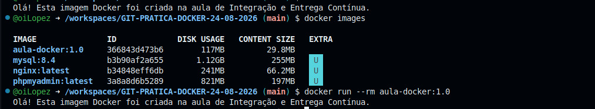
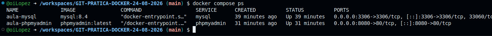

# GIT-PRATICA-DOCKER-24-08-2026

## 1. Identificação

Atividade prática referente ao dia **24/08/2026**, do componente curricular **Integração e Entrega Contínua**, do curso de **Desenvolvimento de Software Multiplataforma – 4º semestre**, da **FATEC Mauá**, ministrada pelo professor **Carlos Ronny**.

**Aluno(a):** Thaisa Vitória

---

## 2. Docker no Codespaces

A atividade foi realizada em um ambiente **GitHub Codespaces**.

A disponibilidade do Docker foi verificada através dos comandos:

```bash
docker --version
docker info
```

Versão do Docker utilizada:

```text
Docker version 29.3.0-1
```

O comando `docker info` foi executado com sucesso, confirmando que o Docker estava disponível e funcionando corretamente no ambiente.

O Docker Compose também estava disponível na versão:

```text
Docker Compose v2.40.3
```

---

## 3. Contêiner Nginx

Foi utilizada a imagem oficial `nginx:latest` para criar um contêiner chamado `meu_nginx`.

Primeiramente, a imagem foi obtida através do comando:

```bash
docker pull nginx:latest
```

Sua presença no ambiente foi confirmada com:

```bash
docker images
```

Em seguida, o contêiner foi iniciado em segundo plano utilizando:

```bash
docker run -d --name meu_nginx -p 8080:80 nginx:latest
```

O parâmetro `-d` executou o contêiner em segundo plano, enquanto o mapeamento `8080:80` associou a porta `8080` do ambiente do Codespace à porta `80` utilizada pelo Nginx dentro do contêiner.

A execução foi confirmada com:

```bash
docker ps
```

O serviço foi acessado com sucesso através da porta encaminhada pelo GitHub Codespaces, exibindo a página padrão do Nginx.

Também foi realizado o acesso ao interior do contêiner utilizando:

```bash
docker exec -it meu_nginx sh
```

Dentro do contêiner, foi verificado o diretório padrão utilizado pelo Nginx:

```bash
ls /usr/share/nginx/html
```

Foram encontrados os arquivos:

```text
50x.html
index.html
```

Após os testes, o contêiner foi parado e removido através dos comandos:

```bash
docker stop meu_nginx
docker rm meu_nginx
```

A imagem `nginx:latest` permaneceu disponível no ambiente Docker.

---

## 4. Imagem personalizada

Foi criada uma imagem Docker personalizada utilizando um arquivo `Dockerfile`.

O arquivo utilizado foi:

```dockerfile
FROM ubuntu:24.04
WORKDIR /app
COPY hello.txt .
CMD ["cat", "hello.txt"]
```

O `Dockerfile` utiliza a imagem `ubuntu:24.04` como base, define `/app` como diretório de trabalho, copia o arquivo `hello.txt` para dentro da imagem e determina que seu conteúdo seja exibido quando o contêiner for iniciado.

O arquivo `hello.txt` contém a seguinte mensagem:

```text
Olá! Esta imagem Docker foi criada na aula de Integração e Entrega Contínua.
```

A imagem personalizada foi construída através do comando:

```bash
docker build -t aula-docker:1.0 .
```

**Nome da imagem:** `aula-docker`

**Tag:** `1.0`

A presença da imagem foi confirmada com:

```bash
docker images
```

Posteriormente, a imagem foi executada através do comando:

```bash
docker run --rm aula-docker:1.0
```

Resultado obtido:

```text
Olá! Esta imagem Docker foi criada na aula de Integração e Entrega Contínua.
```

O resultado confirmou que o arquivo `hello.txt` foi corretamente incluído na imagem e executado conforme definido no `Dockerfile`.

---

## 5. Docker Compose

Foi criado o arquivo `compose.yaml` contendo dois serviços:

* MySQL 8.4
* phpMyAdmin

Também foi criado o volume `mysql-data`, responsável pela persistência dos dados armazenados pelo MySQL.

O ambiente foi iniciado através do comando:

```bash
docker compose up -d
```

A execução dos serviços foi confirmada com:

```bash
docker compose ps
```

Foram iniciados os seguintes contêineres:

```text
aula-mysql
aula-phpmyadmin
```

O MySQL foi disponibilizado através da porta:

```text
3306
```

O phpMyAdmin foi disponibilizado através da porta:

```text
8080
```

O acesso ao phpMyAdmin foi realizado através da porta encaminhada pelo GitHub Codespaces.

Foram utilizadas as seguintes credenciais fornecidas para a atividade:

```text
Usuário: root
Senha: root_password
```

> A senha `root_password` foi utilizada somente para fins didáticos durante a atividade.

Após o acesso ao phpMyAdmin, foi confirmada a existência do banco:

```text
aula_db
```

---

## 6. Persistência

Para verificar a persistência de dados do MySQL foi utilizado o volume Docker:

```text
mysql-data
```

No banco `aula_db`, foi criada a tabela `mensagem` através do seguinte comando SQL:

```sql
CREATE TABLE mensagem (
  id INT AUTO_INCREMENT PRIMARY KEY,
  texto VARCHAR(100) NOT NULL
);
```

Em seguida, foi inserido um registro:

```sql
INSERT INTO mensagem (texto)
VALUES ('Dados persistidos com volume Docker');
```

A presença do registro foi confirmada através de:

```sql
SELECT * FROM mensagem;
```

Resultado obtido:

```text
1 | Dados persistidos com volume Docker
```

Após a criação do dado, os contêineres foram removidos com:

```bash
docker compose down
```

Em seguida, o ambiente foi recriado através dos comandos:

```bash
docker compose up -d
docker compose ps
```

O volume `mysql-data` não foi removido durante esse processo.

**Resultado da verificação:** após a remoção e recriação dos contêineres, a tabela `mensagem` e o registro `Dados persistidos com volume Docker` continuaram disponíveis no banco `aula_db`.

Isso confirmou que o volume `mysql-data` preservou os dados do MySQL mesmo após a recriação dos contêineres.

Os dados permaneceram disponíveis porque são armazenados no volume e não diretamente no ciclo de vida do contêiner.

---

## 7. Evidências

As evidências abaixo registram a execução das principais etapas realizadas durante a atividade prática.

### Evidência 1 - Docker disponível no GitHub Codespaces

A versão do Docker e a disponibilidade do ambiente foram verificadas através dos comandos:

```bash
docker --version
docker info
```

Versão utilizada:

```text
Docker version 29.3.0-1
```



O comando `docker info` também foi executado com sucesso, permitindo visualizar informações do Docker Engine e do ambiente utilizado no Codespaces.



---

### Evidência 2 - Imagem Nginx disponível

Após o download da imagem oficial do Nginx, o comando:

```bash
docker images
```

confirmou a presença da imagem:

```text
nginx:latest
```



---

### Evidência 3 - Contêiner Nginx em execução

O contêiner `meu_nginx` foi iniciado e sua execução foi confirmada através do comando:

```bash
docker ps
```

Durante a coleta posterior desta evidência, foi utilizada a porta `8081` para o Nginx, pois a porta `8080` já estava sendo utilizada pelo phpMyAdmin.

Essa alteração foi utilizada apenas para a captura da evidência. Durante a execução original da atividade foi utilizado o mapeamento solicitado:

```text
8080:80
```



---

### Evidência 4 - Acesso ao Nginx pelo navegador

O serviço Nginx foi acessado através da porta encaminhada pelo GitHub Codespaces.

A página padrão **Welcome to nginx!** foi exibida corretamente, confirmando o funcionamento do servidor web.



---

### Evidência 5 - Conteúdo interno do contêiner Nginx

Foi realizado o acesso ao contêiner através de:

```bash
docker exec -it meu_nginx sh
```

Dentro do contêiner foi executado:

```bash
ls /usr/share/nginx/html
```

Resultado:

```text
50x.html
index.html
```



---

### Evidência 6 - Imagem Docker personalizada

A imagem personalizada `aula-docker:1.0` foi criada a partir do `Dockerfile`.

Sua presença foi confirmada através do comando:

```bash
docker images
```

Posteriormente, foi executada através de:

```bash
docker run --rm aula-docker:1.0
```

Resultado:

```text
Olá! Esta imagem Docker foi criada na aula de Integração e Entrega Contínua.
```



---

### Evidência 7 - Serviços executados com Docker Compose

O comando:

```bash
docker compose ps
```

confirmou a execução dos serviços:

```text
aula-mysql
aula-phpmyadmin
```

O MySQL foi disponibilizado na porta `3306` e o phpMyAdmin na porta `8080`.



---

### Evidência 8 - Persistência dos dados no MySQL

Após a execução de:

```bash
docker compose down
docker compose up -d
```

o banco `aula_db` continuou contendo a tabela `mensagem` e o registro:

```text
Dados persistidos com volume Docker
```

A permanência desse registro após a recriação dos contêineres comprova que os dados foram preservados pelo volume `mysql-data`.


---

## 8. Perguntas da atividade

### 1. Qual é a diferença entre uma imagem Docker e um contêiner?

Uma **imagem Docker** é um modelo imutável que contém os arquivos, dependências e instruções necessárias para executar uma aplicação.

Um **contêiner** é uma instância criada a partir dessa imagem e que pode ser executada pelo Docker.

Assim, uma mesma imagem pode ser utilizada para criar vários contêineres.

---

### 2. O que significa o mapeamento de portas `8080:80`?

O mapeamento `8080:80` associa a porta `8080` do ambiente onde o Docker está sendo executado à porta `80` utilizada pela aplicação dentro do contêiner.

Neste exercício, o Nginx e o phpMyAdmin utilizam internamente a porta `80`, enquanto o acesso externo é realizado através da porta `8080` do Codespace.

---

### 3. Qual é a função do Dockerfile neste exercício?

O `Dockerfile` descreve as instruções necessárias para construir a imagem personalizada.

Neste exercício, ele:

* utiliza o Ubuntu 24.04 como imagem base;
* define `/app` como diretório de trabalho;
* copia o arquivo `hello.txt` para dentro da imagem;
* determina que o conteúdo do arquivo seja exibido quando o contêiner for iniciado.

---

### 4. Por que o serviço phpMyAdmin consegue acessar o MySQL usando `PMA_HOST: mysql`?

O Docker Compose cria uma rede para os serviços definidos no arquivo `compose.yaml`.

Dentro dessa rede, os serviços podem se comunicar utilizando seus próprios nomes.

Como o serviço do banco de dados foi definido com o nome `mysql`, o phpMyAdmin consegue localizar o banco através da configuração:

```yaml
PMA_HOST: mysql
```

Dessa forma, não é necessário informar manualmente o endereço IP do contêiner.

---

### 5. Qual é a função do volume `mysql-data`?

O volume `mysql-data` é responsável por armazenar os dados do MySQL fora do ciclo de vida do contêiner.

Isso permite que os dados continuem disponíveis mesmo quando o contêiner do MySQL é removido e posteriormente recriado.

Neste exercício, o volume é associado ao diretório:

```text
/var/lib/mysql
```

Esse é o diretório utilizado pelo MySQL para armazenar seus dados.

---

### 6. O que aconteceria com os dados se o ambiente fosse encerrado com `docker compose down -v`?

A opção `-v` faz com que os volumes associados ao ambiente Docker Compose também sejam removidos.

Portanto, ao executar:

```bash
docker compose down -v
```

o volume `mysql-data` seria removido juntamente com os dados armazenados nele.

Diferentemente do comando:

```bash
docker compose down
```

utilizado no teste de persistência, os dados não permaneceriam disponíveis após a recriação do ambiente.

---

## 9. Arquivos da atividade

O repositório contém os seguintes arquivos principais:

```text
Dockerfile
hello.txt
compose.yaml
README.md
evidencias/
```

A pasta `evidencias` contém as capturas de tela utilizadas para documentar e comprovar a execução das etapas da atividade.

Uma possível organização do repositório é:

```text
GIT-PRATICA-DOCKER-24-08-2026/
├── Dockerfile
├── hello.txt
├── compose.yaml
├── README.md
└── evidencias/
    ├── 01-docker-codespaces.jpeg
    ├── 02-docker-codespaces.jpeg
    ├── 03-nginx-image.jpeg
    ├── 04-nginx-container.jpeg
    ├── 05-nginx-browser.jpeg
    ├── 06-nginx-files.jpeg
    ├── 07-imagem-personalizada.jpeg
    ├── 08-docker-compose.jpeg
    └── persistencia-phpmyadmin.jpeg
```

Esses arquivos permitem compreender o desenvolvimento da atividade, visualizar as evidências de execução e reconstruir o ambiente Docker utilizado durante a prática.

